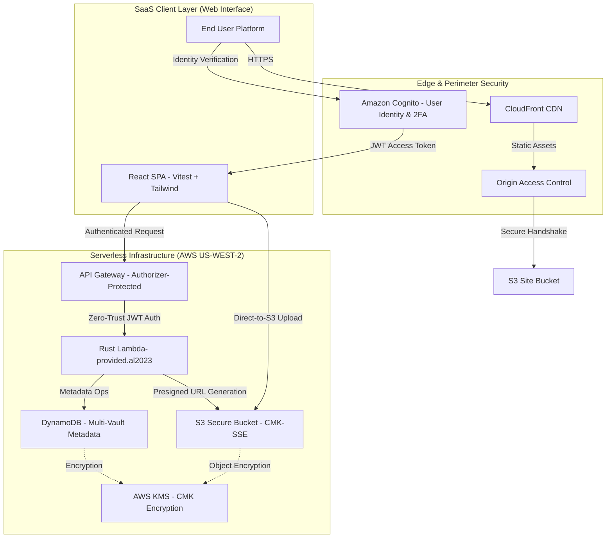

# Secure File Storage - Deep Architecture Documentation

## System Flow Architecture

This document explains the "Why" and "How" of the crucial mechanisms inside the Secure Storage repository.

## 0. Identity & Perimeter Security (Amazon Cognito)

To reach a production-grade "Zero Trust" model, the platform leverages **Amazon Cognito** for comprehensive identity management.

-   **JWT-Based Authorization**: Every request to the `{proxy+}` API Gateway resource must carry a valid Cognito ID Token in the `Authorization` header. The **CognitoUserPoolsAuthorizer** performs a native, low-latency validation of the token's signature, issuer, and expiration before the Rust Lambda is even invoked.
-   **Multi-Factor Authentication (2FA/TOTP)**:
    -   **Tactical Hardening**: We implemented Time-based One-Time Password (TOTP) secondary verification.
    -   **The Handshake**: The enrollment consists of a three-way handshake: (1) `setUpTOTP` generates a cryptographically secure secret, (2) the frontend renders an `otpauth` URI via a QR code, and (3) `verifyTOTPSetup` confirms the user has successfully synced their device before enabling the `PREFERRED` MFA state.
    -   **Challenge Detection**: During sign-in, Cognito intelligently detects the MFA state and returns a `CONFIRM_SIGN_IN_WITH_TOTP_CODE` challenge, which the React frontend handles by dynamically switching to a tactical authentication interface.

## 1. Multi-Vault Partitioning Model (Architecture Refactor)

The system has transitioned from a flat user-based storage model to a **Multi-Vault Partitioning Model**. This allows a single user to manage multiple isolated "Vaults" (environments), each with its own root directory and metadata.

*   **Partitioning Strategy**: We utilize a **Composite Partition Key** pattern in DynamoDB.
    *   **Vault Metadata**: Stored under `PK: USER#<owner_id>` and `SK: VAULT#<vault_id>`. This allows for efficient listing of all vaults belonging to a user.
    *   **Vault Items**: All files and folders within a vault are stored under `PK: VAULT#<vault_id>`. This ensures absolute data isolation; a query for a specific vault ID will never leak data from another.
*   **The Folder Index V2**: To support deep nesting within vaults, we implemented `FolderIndexV2`. This Global Secondary Index (GSI) is partitioned by `PK` (the vault) and `ParentID`. This allows the UI to instantly list all items in a specific folder without scanning the entire vault.

## 2. API Layer: Proxy+ Integration

To achieve a perfectly fluid and reliable API experience, we utilize a **Proxy+ API Gateway Integration**.

*   **Delegated Routing**: Instead of fragile, manual resource mapping in the CloudFormation template, we use a catch-all `{proxy+}` resource. 
*   **Rust-Native Routing**: The Rust Lambda uses the `lambda_http` crate to perform internal pattern matching on the request path and method. This means adding new features (like vault decommissioning) requires zero infrastructure changes.
*   **CORS Mastery**: By using Proxy integration, our Rust backend has 100% control over the CORS handshake. This eliminates "No Access-Control-Allow-Origin" errors by ensuring every response—including error paths—carries the correct pre-shared security headers defined in `handlers.rs`.

## 3. How S3 Presigned URLs Work

When clients need to upload massive files (e.g., 5GB videos) to AWS, piping those bytes directly through an API Gateway and Lambda function introduces strict constraints (API Gateway supports max 10MB payloads, Lambda max 6MB).

To bypass this safely, we decouple the process:
*   **The Request**: The client requests permission via an API POST request (`UploadRequest`), providing a `file_name`, `owner_id`, and `content_type`.
*   **The Compute Evaluation**: Our Rust Lambda ensures the request logic is sound, generates a unique UUID, and commands the `aws-sdk-s3` client to sign a `PUT` token linked directly to that UUID.
*   **The Delivery**: AWS signs this specific URI utilizing our Lambda's strict execution role. We restrict the URI’s expiration to **exactly 15 minutes**.

## 4. The Two-Stage Verification Pulse (Handshake)

To prevent "Ghost Records", we implement a strict state machine:
1.  **PENDING_UPLOAD**: When an upload URL is requested, the DynamoDB record is created with a `Status: PENDING_UPLOAD` tag.
2.  **S3 Transfer**: The browser performs the direct PUT to S3.
3.  **Verification Patch**: Upon a successful `200 OK` from S3, the Frontend makes a secondary `PATCH /uploads` call.
4.  **ACTIVE Status**: The Lambda transitions the record to `Status: ACTIVE`.
*   **Reliability**: Statistics and Directory Listings strictly filter for `ACTIVE` records, ensuring the user dashboard is a "Source of Truth".

## 5. Security at Rest (AWS KMS x DynamoDB)

Instead of relying on AWS Owned Keys, this infrastructure mandates **Customer Managed Keys (CMK)** via AWS KMS:
*   **Rotation**: The `tableKey` instantiated inside `secure-storage-stack.ts` defines `enableKeyRotation: true`. AWS automatically swaps the underlying cryptographic material every year.
*   **The Lambda Grant**: By executing `tableKey.grantEncryptDecrypt(apiHandler)`, CDK dynamically binds `kms:Decrypt`, `kms:ReEncrypt*`, and `kms:GenerateDataKey*` permissions to our active IAM Role.

## 6. Storage Hardening (S3 Bucket Policies)

Public bucket exposures are mitigated across three layers:
*   `blockPublicAccess: s3.BlockPublicAccess.BLOCK_ALL`: Overrides any potentially flawed ACL integrations.
*   `enforceSSL: true`: Automatically injects a resource-based policy that denies requests if the communication does not validate `aws:SecureTransport: "true"`.
*   `encryption: s3.BucketEncryption.S3_MANAGED`: AES-256 block ciphers are strictly evaluated on all objects.

## 7. End-to-End Observability

*   **X-Ray Tracing**: Both the API Gateway and Lambda compute logic define `Tracing.ACTIVE`.
*   **Structured Logging**: Inside Rust, `tracing::info!` formats logs that are natively parsed by CloudWatch, allowing for deep filtering based on `vault_id` or `owner_id`.

## 8. The Case for Rust (Serverless Compute Performance)

The decision to utilize **Rust** (via the `provided.al2023` custom runtime) for the core compute engine was driven by the specific needs of a high-security cloud platform:

1.  **Predictable Latency & Zero Cold-Starts**: Python and Node.js often suffer from cold-start latencies that degrade the user experience. Rust binaries, compiled to machine code, offer near-instant startup times (**~30ms**), ensuring a fluid "SaaS-like" feel on every request.
2.  **Memory-Efficient Scale**: Rust's zero-cost abstractions allow us to execute complex Multi-Vault logic with a minimal memory footprint. While other runtimes might require 512MB+ to stay performant, our Rust Lambda maintains peak throughput at **128MB**, leading to significant cost optimizations at scale.
3.  **Cryptographic Integrity**: When handling pre-signed URLs and vault isolation, memory safety is paramount. Rust’s ownership model provides compile-time guarantees against common memory vulnerabilities, making it the ideal choice for a platform where data privacy is the primary objective.
